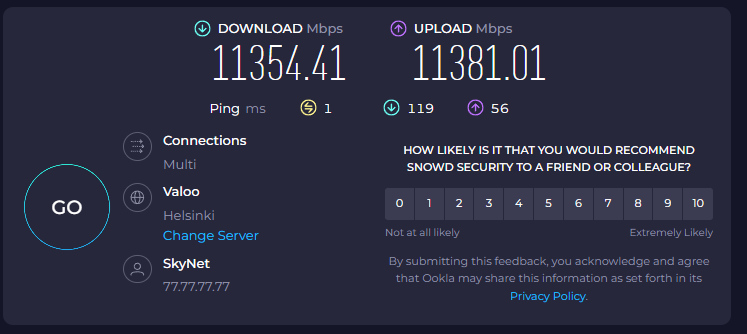
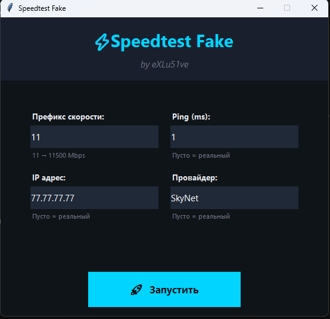

# SpeedtestFake 🚀

Модифицируйте результаты тестирования скорости интернета на speedtest.net в реальном времени.

## Скриншоты 📸

<p align="center">
  
  
</p>

## Скачать 📥

**[Скачать SpeedtestFake.exe](https://github.com/eXLu51ve-gjj/SpeedtestFake/releases/tag/SpeedtestFake.v1.0)**

## Быстрый старт 🎯

1. **Требование:** Google Chrome должен быть установлен
2. **Запустите:** `SpeedtestFake.exe`
3. **Введите значения:**
   - Префикс скорости (обязательно)
   - Ping, IP, Провайдер (опционально)
4. **Нажмите:** "🚀 Запустить"

## Возможности ✨

- 🎯 Кастомизация скорости с префиксом
- 📊 Подмена ping
- 🌐 Смена IP адреса
- 📡 Изменение ISP/Провайдера
- 🎨 Красивый интерфейс
- ⚡ Работает в реальном времени

## Требования ⚠️

| Компонент | Статус |
|-----------|--------|
| **Google Chrome** | **ОБЯЗАТЕЛЬНО** |
| Python (для исходного кода) | 3.8+ |

## Для разработчиков 👨‍💻

```bash
# Установка зависимостей
pip install selenium

# Запуск из исходного кода
python SpeedtestFake.py

# Сборка EXE
pip install pyinstaller
python -m PyInstaller SpeedtestFake.spec --clean
```

## Документация 📚

Подробная документация доступна в [README_SPEEDTEST_FAKE.md](README_SPEEDTEST_FAKE.md)

## Дисклеймер ⚖️

Приложение предназначено для **образовательных целей и локального тестирования**. Использование для предоставления поддельных результатов может нарушить ToS и рассматриваться как мошенничество.

## Лицензия 📄

MIT License
